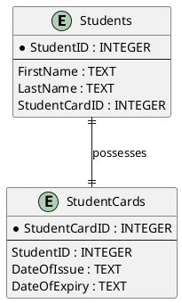
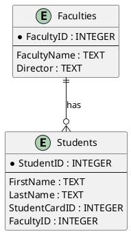
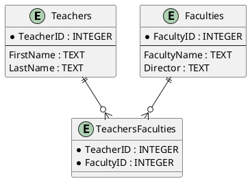

### Диаграмма 1: Студенты и студенческие билеты (один к одному)

### Диаграмма 2: Студенты и факультеты (один ко многим)

### Диаграмма 3: Преподаватели и факультеты (многие ко многим)

### Пояснения

1. **Диаграмма 1**:
   - Студенты и студенческие билеты связаны отношением "один-к-одному". 
   - В таблице `Students` есть внешний ключ `StudentCardID`, который ссылается на `StudentCardID` в таблице `StudentCards`.
   - В таблице `StudentCards` есть уникальный внешний ключ `StudentID`, который ссылается на `StudentID` в таблице `Students`.

2. **Диаграмма 2**:
   - Студенты и факультеты связаны отношением "один-ко-многим".
   - В таблице `Students` есть внешний ключ `FacultyID`, который ссылается на `FacultyID` в таблице `Faculties`.
   - Один факультет может иметь много студентов, но каждый студент может быть только на одном факультете.

3. **Диаграмма 3**:
   - Преподаватели и факультеты связаны отношением "многие-ко-многим".
   - Для реализации этого отношения создана связующая таблица `TeachersFaculties`, которая содержит внешние ключи `TeacherID` и `FacultyID`, ссылающиеся на соответствующие поля в таблицах `Teachers` и `Faculties`.
   - У преподавателя может быть много факультетов, и у факультета может быть много преподавателей.

Эти диаграммы должны помочь в визуализации структуры вашей базы данных и понимании отношений между таблицами.